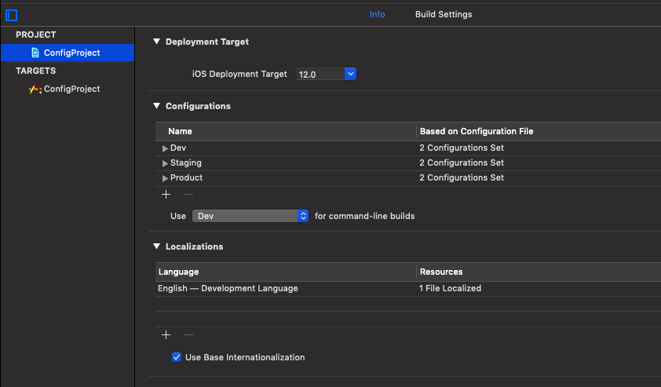
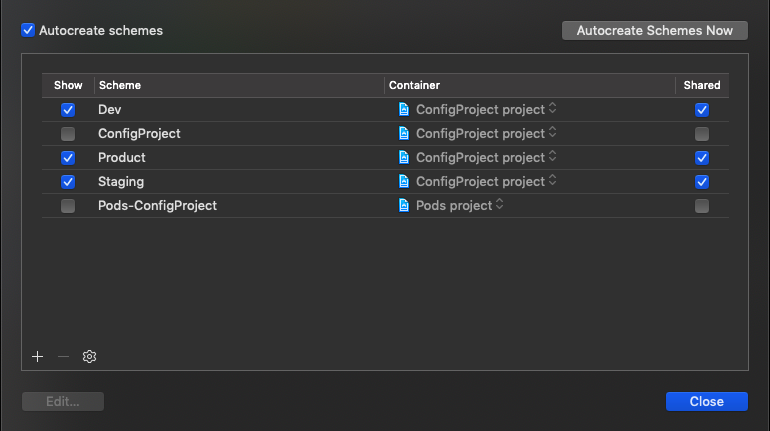
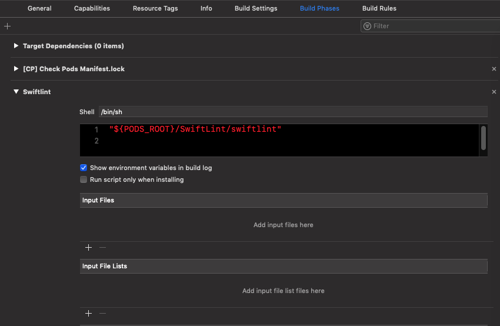
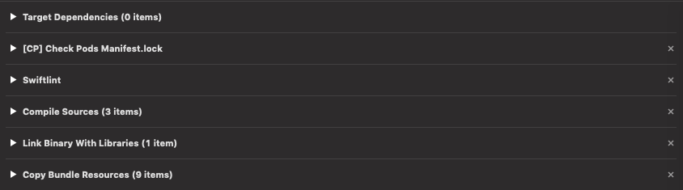
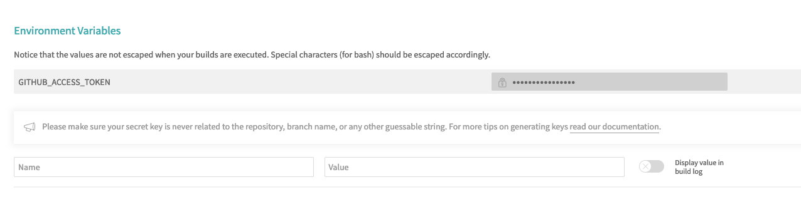
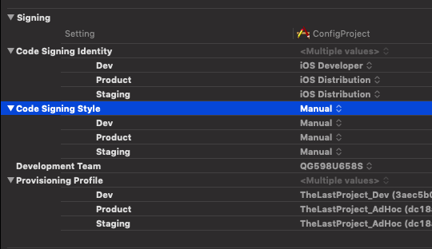
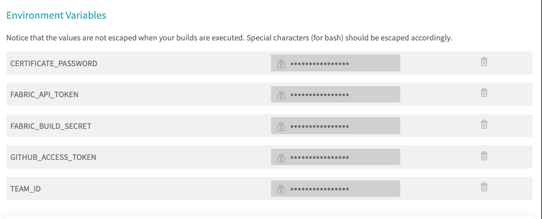
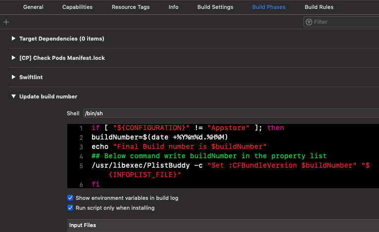

# CONFIGURATION

## ***HOW TO CONFIG A PROJECT FROM A TO Z !!!***

#### **PART 1: INIT**

`STEP 1` Create repo on github and project (Remember add git ingore).

**Open terminal and cd to Project folder**

`STEP 2` Install bundler `gem install bundle`

`STEP 3` Create gemfile by `bundle init`

`STEP 4` Edit gemfile. Example below

```
source "https://rubygems.org"

gem 'fastlane', '2.118.0'
gem 'xcpretty', '0.3.0'
gem 'cocoapods', '1.5.3'
```

`STEP 5` `bundle install` to create gemfile.lock file

`STEP 6` Install cocoapods to project. In terminal, type `bundle exec pod init` to create Podfile

`STEP 7` Edit Podfile and add pod you wants to use. Save it!

`STEP 8` In terminal, type `bundle exec pod intall` to create Podfile.lock and xcworkspace file

**Close terminal and finish part 1**

------

#### PART 2: Create scheme with xcconfig

> Reference: 
>
> - https://medium.freecodecamp.org/managing-different-environments-and-configurations-for-ios-projects-7970327dd9c9
>
> - https://hackernoon.com/a-cleaner-way-to-organize-your-ios-debug-development-and-release-distributions-6b5eb6a48356

`STEP 1` Open xcode -> select project -> info Tab -> add configuration (Ex: I'm going to add 3 scheme: dev, staging, product)

<center>
	
</center>

`STEP 2` In Xcode's menu -> Product -> Scheme -> Manage shemes. Create 3 scheme match with 3 configuarations that you have added.

<center>
	
</center>


`STEP 3` Create xcconfig file with each scheme and add code. You can put keys, backend url, ... correspond to each scheme. Example:

**Dev.xcconfig**

```swift
DISPLAY_NAME = [Dev] Config
PRODUCT_BUNDLE_IDENTIFIER = tung.nguyen.dev.ConfigProject
```

**Staging.xcconfig**

```swift
DISPLAY_NAME = [Stg] Config
PRODUCT_BUNDLE_IDENTIFIER = tung.nguyen.staging.ConfigProject
```

**Product.xcconfig**

```swift
DISPLAY_NAME = ConfigProj
PRODUCT_BUNDLE_IDENTIFIER = tung.nguyen.product.ConfigProject
```

`STEP 4` Add plist file for each scheme. One plist file can be used by mutiple schemes -> Add row to plist file

`STEP 5` Add file Pod xcconfig match with each scheme

`STEP 6` Change `Configuration File` in `Configurations` in `STEP 1` match with each scheme

`STEP 7` Edit scheme match with enviroment that you wants to build.

**DONE PART 2**

------

#### PART 3: Config with Travis-CI
`STEP 1` Sign in github account in travis (Travis-ci.org for free)

`STEP 2` Select repository to activate travis ci

`STEP 3` Create file .travis.yml in project root direction

`STEP 4` Add config in .travis.yml. Example:

```
before_install:
    - gem update --system
    - gem install bundler
    - bundle install
    - bundle exec pod install --repo-update
cache:
  - bundler
  - cocoapods
language: objective-c
osx_image: xcode10
xcode_project: ConfigProject.xcworkspace
xcode_scheme: Dev
xcode_destination: platform=iOS Simulator,OS=12.0,name=iPhone X
script:
    - xcodebuild clean build -sdk iphonesimulator -workspace ConfigProject.xcworkspace -scheme Dev
install:
    - sudo systemsetup -settimezone Asia/Ho_Chi_Minh
```
 
**Explanation:**

- `before_install` It's important to install enviroment to run project in CI. If ci failed and return message like this <font color="red">`You must use Bundler 2 or greater with this lockfile.`</font>, you should use the code below to handle this error.

```
- gem update --system
- gem install bundler
```

- `cache` cache process install bundler and cocoapod in order to save the time

- `script` put code config CI to operate CI as you want. Here, I put the code below to use xcodebuild to build project in travis if your project not have unit test (default travis use xctool and you must have test target in scheme which you want to build)
`- xcodebuild clean build -sdk iphonesimulator -workspace ConfigProject.xcworkspace -scheme Dev`

- `install` to install more ultilities

`STEP 5` Commit and push to github. Waiting for CI :D

**DoNe!!!**

------

#### PART 4: Swiftlint & Linter bot

`STEP 1` Import swiftlint in podfile

```pod 'SwiftLint'```

and run `bundle exec pod install` in terminal

`STEP 2` Create **new run script phase** in **Build phases** and import 

```"${PODS_ROOT}/SwiftLint/swiftlint"```

<center>
	
</center>

Remember move `Swiftlint` phase run before Compile Resource` phase

<center>
	
</center>

Finish config swiftlint in Xcode


`STEP 3` Now config swiftlint with Travis-CI. Create .swiftlint.yml file with expamle content below

```
disabled_rules: # rule identifiers to exclude from running
  - colon
  - comma
  - control_statement
opt_in_rules: # some rules are only opt-in
  - empty_count
  # Find all the available rules by running:
  # swiftlint rules
excluded: # paths to ignore during linting. Takes precedence over `included`.
  - Carthage
  - Pods
  - vendor
analyzer_rules: # Rules run by `swiftlint analyze` (experimental)
  - explicit_self

# configurable rules can be customized from this configuration file
# binary rules can set their severity level
force_cast: warning # implicitly
force_try:
  severity: warning # explicitly
# rules that have both warning and error levels, can set just the warning level
# implicitly
line_length: 110
# they can set both implicitly with an array
type_body_length:
  - 300 # warning
  - 400 # error
# or they can set both explicitly
file_length:
  warning: 500
  error: 1200
# naming rules can set warnings/errors for min_length and max_length
# additionally they can set excluded names
type_name:
  min_length: 4 # only warning
  max_length: # warning and error
    warning: 40
    error: 50
  excluded: iPhone # excluded via string
identifier_name:
  min_length: # only min_length
    error: 3 # only error
  excluded: # excluded via string array
    - id
    - URL
    - GlobalAPIKey
reporter: "xcode" # reporter type (xcode, json, csv, checkstyle, junit, html, emoji, sonarqube, markdown)
```

`STEP 4` Config linterbot...
Add gem in `Gemfile`: ```gem 'linterbot'```

then install: ```bundle install```

`STEP 5` Create non-extension file with TextEdit on Mac (Format -> Make Plain Text), save it in project root direction (I put it in scripts folder) and named it is `lint` with content below

```
#!/bin/bash

./Pods/SwiftLint/swiftlint lint --reporter json > swiftlint-report.json || false

if [ "$TRAVIS_PULL_REQUEST" != "false" ]
	echo 'Not in a pull request, skip report'
then
  bundle exec linterbot $TRAVIS_REPO_SLUG $TRAVIS_PULL_REQUEST < swiftlint-report.json
fi
```

`STEP 6` To grand permission for `lint`, open terminal and type:

```chmod +x [drag file lint to terminal]```

`STEP 7` Edit .travis.yml

```
before_install:
    - gem update --system
    - gem install bundler
    - bundle install
    - bundle exec pod install --repo-update
    - gem install linterbot
    - brew install swiftlint
```

Add config at `script`, put direction to file `lint` in project (Here I put `lint` in `scripts` folder)

```
script:
  - ./scripts/lint
```

`STEP 8` Create a access key for linter bot can post/comment in your repo ([How to create a access key](https://help.github.com/en/articles/creating-a-personal-access-token-for-the-command-line)).

`STEP 9` Put access key into Travis-CI. Open`travis-ci.org` and go to your repo's settings. Put the key into `Enviroment Variables` with Name is `GITHUB_ACCESS_TOKEN` and value is your key

<center>
	
</center>

`STEP 10` Push all changes to github. Waiting for CI and Linterbot :D

**ENOD**

-----
#### PART 5: Config fastlane
`STEP 1` Create folder contain your certificate, provision file and commit to github

`STEP 2` Run `fastlane init` to create fastfile

`STEP 3` Edit fast file and run locally to test `bundle exec fastlane test`

```
lane :test do
    build_app(
      scheme: "Dev",
      configuration: "Dev",
      clean: true,
      output_name: "ConfigProject.ipa",
      skip_profile_detection: true,
      export_method: "development",
      export_options: {
        provisioningProfiles: { "com.fx.thelastproject": "TheLastProject_Dev" }
      }
    )
  end
```

`STEP 4` Edit config at `Build settings` in your xcworkspace if you get error about provisioning and certificate

<center>
	
</center>

`STEP 5` If run fastlane test successfully in local, you should edit fastfile and commit it to fastlane run on CI

```
default_platform(:ios)

platform :ios do

  desc "test build dev"
  lane :deploy_dev do
    config_cer_provision(
      certificate_path: "./Cers/dev.p12",
      profile: "./Cers/TheLastProject_Dev.mobileprovision",
      build_configuration: "Dev"
    )

    build_app_with(
      scheme: "Dev", 
      configuration: "Dev",
      bundle: "com.fx.thelastproject",
      provisioning: "TheLastProject_Dev",
      export_method: "development"
    )
  end

  desc "Build app with options"
  private_lane :build_app_with do |options|
    build_app(
      scheme: "#{options[:scheme]}",
      configuration: "#{options[:configuration]}",
      clean: true,
      output_name: "ConfigProject.ipa",
      skip_profile_detection: true,
      export_method: "#{options[:export_method]}",
      export_options: {
        provisioningProfiles: { "#{options[:bundle]}": "#{options[:provisioning]}" }
      }
    )
  end
  
  desc "Import certificate"
  private_lane :config_cer_provision do |options|
    import_certificate(
      keychain_name: "ios-build.keychain",
      keychain_password: "travis",
      certificate_path: "#{options[:certificate_path]}",
      certificate_password: ENV["CERTIFICATE_PASSWORD"]
    )
    
    update_project_provisioning(
      xcodeproj: "ConfigProject.xcodeproj",
      profile: "#{options[:profile]}",
      target_filter: "ConfigProject",
      build_configuration: "#{options[:build_configuration]}"
    )

    update_project_team(
      path: "ConfigProject.xcodeproj",
      teamid: ENV["TEAM_ID"]
    )
  end
end
```

**NOTICE**: To create variable enviroment (ENV["KEY"]) -> Travis setting on your repository -> Add key and value to hide information that you dont want to public

<center>
	
</center>

`STEP 6` Code signing on CI. Create add-key.sh file

```
#!/bin/sh
# Create a custom keychain
security create-keychain -p travis ios-build.keychain

# Make the custom keychain default, so xcodebuild will use it for signing
security default-keychain -s ios-build.keychain

# Unlock the keychain
security unlock-keychain -p travis ios-build.keychain

# Set keychain timeout to 1 hour for long builds
# see http://www.egeek.me/2013/02/23/jenkins-and-xcode-user-interaction-is-not-allowed/
security set-keychain-settings -t 3600 -l ~/Library/Keychains/ios-build.keychain

# Add certificates to keychain and allow codesign to access them
security import ./Cers/dev.p12 -k ~/Library/Keychains/ios-build.keychain -P $CERTIFICATE_PASSWORD -T /usr/bin/codesign
security import ./Cers/dis.p12 -k ~/Library/Keychains/ios-build.keychain -P $CERTIFICATE_PASSWORD -T /usr/bin/codesign

security set-key-partition-list -S apple-tool:,apple: -s -k travis ios-build.keychain

echo "list keychains: "
security list-keychains
echo " ****** "

echo "find indentities keychains: "
security find-identity -p codesigning  ~/Library/Keychains/ios-build.keychain
echo " ****** "

# Put the provisioning profile in place
mkdir -p ~/Library/MobileDevice/Provisioning\ Profiles

uuid=`grep UUID -A1 -a ./Cers/TheLastProject_Dev.mobileprovision | grep -io "[-A-F0-9]\{36\}"`
cp ./Cers/TheLastProject_Dev.mobileprovision ~/Library/MobileDevice/Provisioning\ Profiles/$uuid.mobileprovision

uuid=`grep UUID -A1 -a ./Cers/TheLastProject_AdHoc.mobileprovision | grep -io "[-A-F0-9]\{36\}"`
cp ./Cers/TheLastProject_AdHoc.mobileprovision ~/Library/MobileDevice/Provisioning\ Profiles/$uuid.mobileprovision

``` 
**Notice:** `$CERTIFICATE_PASSWORD` is password of your p12 files which was defined as enviroment variable in travis or you can replace `$CERTIFICATE_PASSWORD` with password of p12 files .Check and edit files direction match with folder you created at `STEP 1`

`STEP 7` Update .travis.yml and commit all to github. Waiting for CI

```
before_script:
  - chmod +x ./scripts/add-key.sh
  - sh ./scripts/add-key.sh
script:
  - bundle exec fastlane deploy_dev
```

**NEDO!!!**

-----

#### PART 6: Deploy on Fabric
##### A. Build dev-enviroment when merge a PR to develop branch and notify to group QCs on Fabric
`STEP 1` Log in & create organization on Fabric.io

`STEP 2` [Config fabric on your project and run](https://fabric.io/kits/ios/crashlytics/install)

`STEP 3` Now, your app is already on Fabric. Go to Fabric.io to create group (I created 2 groups: QCs and PMs) to allow another account test your app

`STEP 4` At menu Fabric.io -> Beta -> Add testers

`STEP 5` Edit build number follow datetime in xcworkspace. Go to `Build phase` -> add `New run script phase` -> Rename to `Update build number`-> add code below

```
if [ "${CONFIGURATION}" != "Appstore" ]; then
    buildNumber=$(date +%Y%m%d.%H%M)
    echo "Final Build number is $buildNumber"
    ## Below command write buildNumber in the property list
    /usr/libexec/PlistBuddy -c "Set :CFBundleVersion $buildNumber" "${INFOPLIST_FILE}"
fi

```
Move `Update build number` phase run after `Swiftlint` phase

<center>
	
</center>

`STEP 6` Update code in .travis.yml to check condition when merge PR to develop branch.

Edit

```
script:
  - bundle exec fastlane deploy_dev
```
To

```
script:
  - if [[ "$TRAVIS_BRANCH" == "develop" && "$TRAVIS_PULL_REQUEST" == 
"false" ]]; then bundle exec fastlane deploy_dev; fi
```

`STEP 7` Update fastfile in order to notify to QCs group when upload new build successfully, and create release note for each build

```
default_platform(:ios)

platform :ios do

  desc "test build dev"
  lane :deploy_dev do
    config_cer_provision(
      certificate_path: "./Cers/dev.p12",
      profile: "./Cers/TheLastProject_Dev.mobileprovision",
      build_configuration: "Dev"
    )

    build_app_with(
      scheme: "Dev", 
      configuration: "Dev",
      bundle: "com.fx.thelastproject",
      provisioning: "TheLastProject_Dev",
      export_method: "development"
    )

    create_release_notes(format: 'DEV: %h %s')

    # upload to Beta by Crashlytics
    upload_fabric(groups: "qcs")
  end

  desc "Build app with options"
  private_lane :build_app_with do |options|
    build_app(
      scheme: "#{options[:scheme]}",
      configuration: "#{options[:configuration]}",
      clean: true,
      output_name: "ConfigProject.ipa",
      skip_profile_detection: true,
      export_method: "#{options[:export_method]}",
      export_options: {
        provisioningProfiles: { "#{options[:bundle]}": "#{options[:provisioning]}" }
      }
    )
  end

  desc "Upload to Fabric with options"
  private_lane :upload_fabric do |options|
    crashlytics(
      api_token: ENV["FABRIC_API_TOKEN"],
      build_secret: ENV["FABRIC_BUILD_SECRET"],
      groups: ["#{options[:groups]}"]
    )
  end
  
  desc "Import certificate"
  private_lane :config_cer_provision do |options|
    import_certificate(
      keychain_name: "ios-build.keychain",
      keychain_password: "travis",
      certificate_path: "#{options[:certificate_path]}",
      certificate_password: ENV["CERTIFICATE_PASSWORD"]
    )
    
    update_project_provisioning(
      xcodeproj: "ConfigProject.xcodeproj",
      profile: "#{options[:profile]}",
      target_filter: "ConfigProject",
      build_configuration: "#{options[:build_configuration]}"
    )

    update_project_team(
      path: "ConfigProject.xcodeproj",
      teamid: ENV["TEAM_ID"]
    )
  end


  desc "Create release notes"
  private_lane :create_release_notes do |options|
    sh "git log -1 --pretty=tformat:\"#{options[:format]}\" > release_notes.txt"
  end

end
```

`STEP 8` Commit to github and wait....

##### B. Build staging-enviroment when merge a PR to master branch and notify to group PMs on Fabric

`STEP 1` Update code in fastfile to allow fastlane build staging

```
desc "test build stg"
  lane :deploy_stg do
    config_cer_provision(
      certificate_path: "./Cers/dis.p12",
      profile: "./Cers/TheLastProject_AdHoc.mobileprovision",
      build_configuration: "Staging"
    )

    build_app_with(
      scheme: "Staging", 
      configuration: "Staging",
      bundle: "com.fx.thelastproject",
      provisioning: "TheLastProject_AdHoc",
      export_method: "ad-hoc"
    )

    create_release_notes(format: 'STG: %h %s')

    # upload to Beta by Crashlytics
    upload_fabric(groups: "pms")
  end
``` 
`STEP 2` Update .travis.yml file

```
- if [[ "$TRAVIS_BRANCH" == "master" && "$TRAVIS_PULL_REQUEST" == "false" ]]; then bundle exec fastlane deploy_stg; fi
```

`STEP 3` Commit and wait for CI

##### C. Deploy ipa file with draft release on github when pushing branch has prefix "release/..."

`STEP 1` Update fastfile to build production

```
desc "test build Product"
  lane :deploy_product do
    config_cer_provision(
      certificate_path: "./Cers/dis.p12",
      profile: "./Cers/TheLastProject_AdHoc.mobileprovision",
      build_configuration: "Product"
    )

    build_app_with(
      scheme: "Product", 
      configuration: "Product",
      bundle: "com.fx.thelastproject",
      provisioning: "TheLastProject_AdHoc",
      export_method: "ad-hoc"
    )
  end
```
The FINAL Fastfile

```
default_platform(:ios)

platform :ios do

  desc "test build stg"
  lane :deploy_stg do
    config_cer_provision(
      certificate_path: "./Cers/dis.p12",
      profile: "./Cers/TheLastProject_AdHoc.mobileprovision",
      build_configuration: "Staging"
    )

    build_app_with(
      scheme: "Staging", 
      configuration: "Staging",
      bundle: "com.fx.thelastproject",
      provisioning: "TheLastProject_AdHoc",
      export_method: "ad-hoc"
    )
    create_release_notes(format: 'STG: %h %s')

    # upload to Beta by Crashlytics
    upload_fabric(groups: "pms")
  end

  desc "test build dev"
  lane :deploy_dev do
    config_cer_provision(
      certificate_path: "./Cers/dev.p12",
      profile: "./Cers/TheLastProject_Dev.mobileprovision",
      build_configuration: "Dev"
    )

    build_app_with(
      scheme: "Dev", 
      configuration: "Dev",
      bundle: "com.fx.thelastproject",
      provisioning: "TheLastProject_Dev",
      export_method: "development"
    )

    create_release_notes(format: 'DEV: %h %s')

    # upload to Beta by Crashlytics
    upload_fabric(groups: "qcs")
  end

  desc "test build Product"
  lane :deploy_product do
    config_cer_provision(
      certificate_path: "./Cers/dis.p12",
      profile: "./Cers/TheLastProject_AdHoc.mobileprovision",
      build_configuration: "Product"
    )

    build_app_with(
      scheme: "Product", 
      configuration: "Product",
      bundle: "com.fx.thelastproject",
      provisioning: "TheLastProject_AdHoc",
      export_method: "ad-hoc"
    )
  end

  desc "Build app with options"
  private_lane :build_app_with do |options|
    build_app(
      scheme: "#{options[:scheme]}",
      configuration: "#{options[:configuration]}",
      silent: true,
      clean: true,
      output_name: "ConfigProject.ipa",
      skip_profile_detection: true,
      export_method: "#{options[:export_method]}",
      export_options: {
        provisioningProfiles: { "#{options[:bundle]}": "#{options[:provisioning]}" }
      }
    )
  end

  desc "Upload to Fabric with options"
  private_lane :upload_fabric do |options|
    crashlytics(
      api_token: ENV["FABRIC_API_TOKEN"],
      build_secret: ENV["FABRIC_BUILD_SECRET"],
      notes_path: "./fastlane/release_notes.txt",
      groups: ["#{options[:groups]}"]
    )
  end

  desc "Import certificate"
  private_lane :config_cer_provision do |options|
    import_certificate(
      keychain_name: "ios-build.keychain",
      keychain_password: "travis",
      certificate_path: "#{options[:certificate_path]}",
      certificate_password: ENV["CERTIFICATE_PASSWORD"]
    )
    
    update_project_provisioning(
      xcodeproj: "ConfigProject.xcodeproj",
      profile: "#{options[:profile]}",
      target_filter: "ConfigProject",
      build_configuration: "#{options[:build_configuration]}"
    )

    update_project_team(
      path: "ConfigProject.xcodeproj",
      teamid: ENV["TEAM_ID"]
    )
  end

  desc "Create release notes"
  private_lane :create_release_notes do |options|
    sh "git log -1 --pretty=tformat:\"#{options[:format]}\" > release_notes.txt"
  end
end
```
The final .travis.yml file

```
before_install:
    - gem update --system
    - gem install bundler
    - bundle install
    - bundle exec pod install --repo-update
cache:
  - bundler
  - cocoapods
language: objective-c
osx_image: xcode10
xcode_project: ConfigProject.xcworkspace
xcode_scheme: Dev
xcode_destination: platform=iOS Simulator,OS=12.0,name=iPhone X
before_script:
  - chmod +x ./scripts/add-key.sh
  - sh ./scripts/add-key.sh
script:
    - ./scripts/lint
    - if [[ "$TRAVIS_BRANCH" == "develop" && "$TRAVIS_PULL_REQUEST" == "false" ]]; then bundle exec fastlane deploy_dev; fi
    - if [[ "$TRAVIS_BRANCH" == "master" && "$TRAVIS_PULL_REQUEST" == "false" ]]; then bundle exec fastlane deploy_stg; fi
    - if [[ "$TRAVIS_BRANCH" =~ "release"* && "$TRAVIS_PULL_REQUEST" == "false" ]]; then bundle exec fastlane deploy_product; fi
    - xcodebuild clean build -sdk iphonesimulator -workspace ConfigProject.xcworkspace -scheme Dev
install:
    - sudo systemsetup -settimezone Asia/Ho_Chi_Minh
deploy:
  provider: releases
  api_key: $GITHUB_ACCESS_TOKEN
  file: ./ConfigProject.ipa
  skip_cleanup: true
  draft: true
  on:
    all_branches: true
    condition: $TRAVIS_BRANCH = "release"*
```

`STEP 8` Commit, wait and Finish. Quẩy time!!!

## FINISH CONFIG PROJECT TUTORIAL

